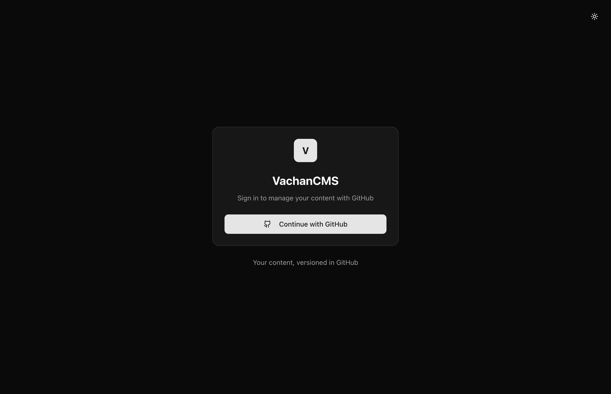
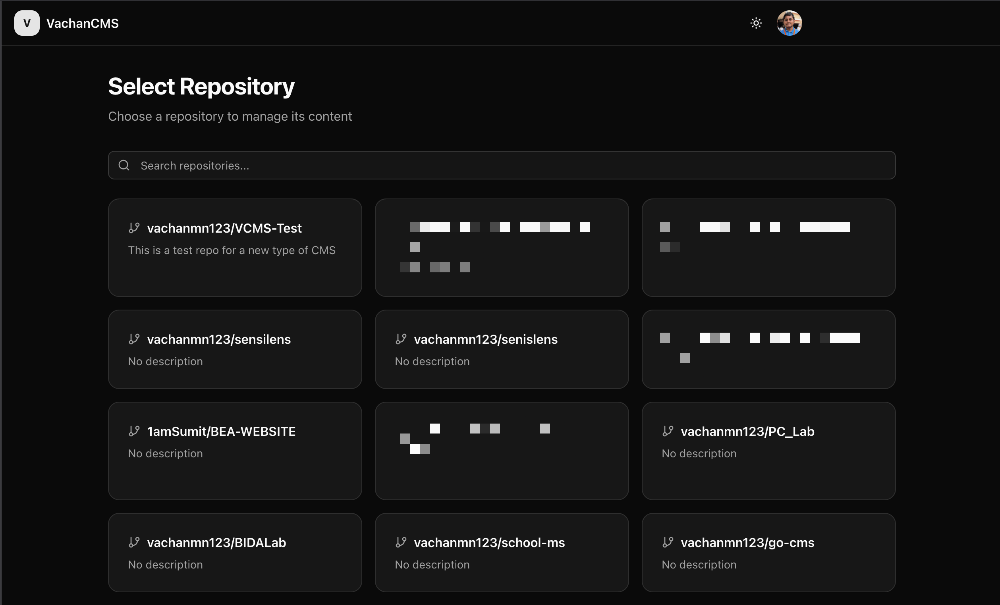
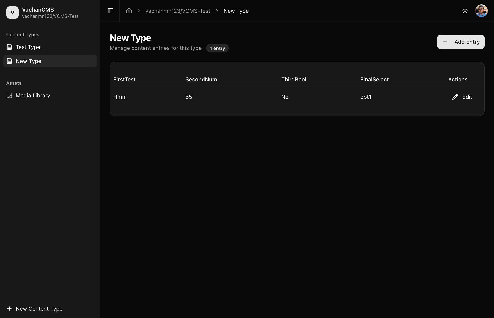
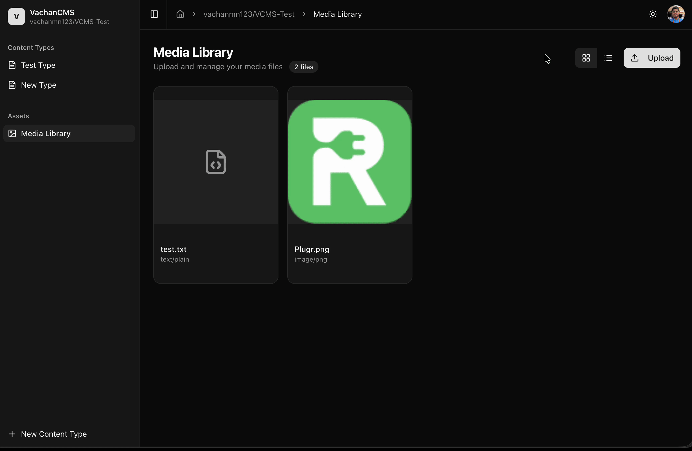

# VachanCMS


A headless CMS that uses GitHub repositories as the backend storage. Content is versioned via Git and can be served directly via GitHub Pages. Includes a modern Vue.js admin interface for content management.

# NOTE: This is a concept I am experimenting with and is not production-ready. Use at your own risk.

## The Concept

VachanCMS takes a unique approach to content management:

1. **GitHub as Database** - All content, configuration, and media files are stored as JSON files in a GitHub repository
2. **Git-Powered Versioning** - Every change is a commit, giving you full version history and collaboration features for free
3. **GitHub Pages Ready** - Content is structured to be consumed by static site generators and served via GitHub Pages
4. **Modern Admin Interface** - A Vue.js frontend for managing content, media, and configuration

This approach eliminates the need for a traditional database while providing built-in version control, backup, and the familiar GitHub collaboration workflow.

## Screenshots


*GitHub OAuth login*


*Select or initialize a repository as a CMS*


*Content management dashboard*


*Media library with drag-and-drop upload*

## Features

### Backend
- **GitHub OAuth Authentication** - Secure login using your GitHub account
- **Repository Management** - Initialize any GitHub repo as a CMS with proper directory structure
- **Dynamic Content Types** - Define custom content schemas with typed fields (text, number, boolean, select)
- **Content Management** - Create, read, update content instances with validation
- **Media Uploads** - Store and serve images, documents, and other files
- **Pagination** - Efficient pagination for large content collections

### Frontend
- **Modern UI** - Clean, responsive interface built with Shadcn-vue components
- **Dark/Light Mode** - Theme toggle with system preference detection
- **Dynamic Forms** - Auto-generated forms based on content type definitions
- **Media Library** - Grid/list view with drag-and-drop uploads and file preview
- **Real-time Feedback** - Toast notifications for all operations

## Prerequisites

- **Go 1.25+** installed on your system
- **Node.js 18+** and **pnpm** (for frontend development)
- **GitHub OAuth Application** - [Create one here](https://github.com/settings/developers)
  - Set the callback URL to `http://localhost:8080/api/auth/callback` (for local development)

## Installation

```bash
# Clone the repository
git clone https://github.com/vachanmn123/vachancms.git
cd vachancms

# Install backend dependencies
go mod download

# Install frontend dependencies
cd frontend
pnpm install
cd ..
```

## Configuration

Create a `.env` file in the project root:

```env
# Required
GITHUB_CLIENT_ID=your_github_oauth_client_id
GITHUB_CLIENT_SECRET=your_github_oauth_client_secret
GITHUB_REDIRECT_URL=http://localhost:8080/api/auth/callback
ENCRYPTION_KEY=your-32-byte-encryption-key-here # This is used to store the user's GitHub access token in the JWT securely.
JWT_SECRET=your-jwt-secret-key

# Optional
PORT=8080
PRODUCTION=false
```

| Variable | Required | Description |
|----------|----------|-------------|
| `GITHUB_CLIENT_ID` | Yes | GitHub OAuth App Client ID |
| `GITHUB_CLIENT_SECRET` | Yes | GitHub OAuth App Client Secret |
| `GITHUB_REDIRECT_URL` | Yes | OAuth callback URL |
| `ENCRYPTION_KEY` | Yes | AES encryption key (16, 24, or 32 bytes for AES-128/192/256) |
| `JWT_SECRET` | Yes | Secret for signing JWTs |
| `PORT` | No | Server port (default: `8080`) |
| `PRODUCTION` | No | Set to `true` for production mode |

## Running the Application

### Development Mode

Run the backend and frontend separately for hot-reload during development:

**Terminal 1 - Backend:**
```bash
go run main.go
```

**Terminal 2 - Frontend:**
```bash
cd frontend
pnpm install
pnpm dev
```

Access the application at `http://localhost:5173`. The Vite dev server automatically proxies API requests to the Go backend on port 8080.

### Production Mode

Build the frontend and run the Go server, which serves both the API and the built frontend:

```bash
# Build the frontend
cd frontend
pnpm build
cd ..

# Build and run the backend
go build -o vachancms
./vachancms
```

Access the application at `http://localhost:8080` (or your configured port).

## Getting Started

1. **Open the application** at `http://localhost:5173` (development) or `http://localhost:8080` (production)

2. **Login with GitHub** - Click the login button to authenticate via GitHub OAuth

3. **Select a repository** - Choose an existing repository or initialize a new one as a CMS

4. **Create content types** - Define your content schema with custom fields:
   - **Text** - String values
   - **Number** - Numeric values
   - **Boolean** - True/false toggles
   - **Select** - Dropdown with predefined options

5. **Manage content** - Add, edit, and organize your content entries

6. **Upload media** - Drag and drop files into the media library

Your content is automatically saved as JSON files in the GitHub repository, with full version history.

## Repository Structure

When you initialize a repository, VachanCMS creates the following structure:

```
your-repo/
├── config/
│   └── config.json               # CMS configuration and content type definitions
├── data/
│   └── <content-type-slug>/
│       ├── config.json           # Pagination metadata
│       ├── index-<page>.json     # Paginated content list
│       └── <id>.json             # Individual content items
├── media/
│   ├── config.json               # Media pagination metadata
│   ├── index-<page>.json         # Paginated media list
│   └── <id>                      # Binary media files
└── content/
    └── .gitkeep
```

## Tech Stack

### Backend
| Technology | Purpose |
|------------|---------|
| [Go](https://go.dev/) | Backend language |
| [Gin](https://gin-gonic.com/) | Web framework |
| [go-github](https://github.com/google/go-github) | GitHub API client |
| [golang-jwt](https://github.com/golang-jwt/jwt) | JWT authentication |

### Frontend
| Technology | Purpose |
|------------|---------|
| [Vue 3](https://vuejs.org/) | UI framework (Composition API + TypeScript) |
| [Vite](https://vitejs.dev/) | Build tool and dev server |
| [Tailwind CSS](https://tailwindcss.com/) | Utility-first styling |
| [Shadcn-vue](https://www.shadcn-vue.com/) | Component library |
| [Pinia](https://pinia.vuejs.org/) | State management |
| [Vue Router](https://router.vuejs.org/) | Client-side routing |
| [Axios](https://axios-http.com/) | HTTP client |
| [Zod](https://zod.dev/) | Schema validation |

## Contributing

Contributions are welcome! Please feel free to submit a Pull Request.

## License

This project is licensed under the MIT License - see the [LICENSE](LICENSE) file for details.
